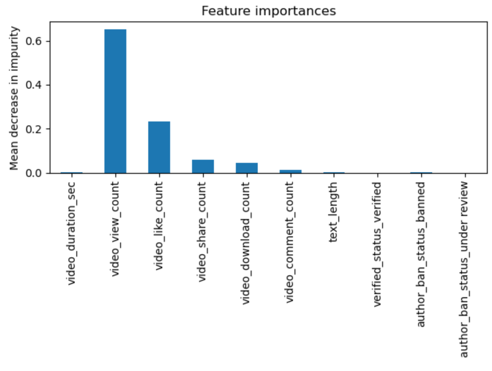
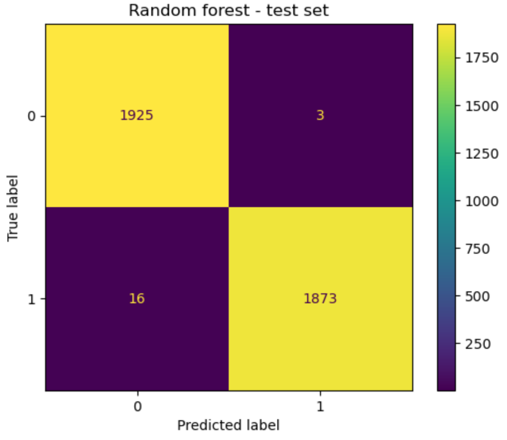

# 📊     Classification-des-vidéos-TikTok

## 📝 Description du Projet
L'objectif de ce projet était de Construire un modèle d'apprentissage automatique (machine learning) capable de déterminer si une vidéo contient une affirmation factuelle ou s'il s'agit d'une opinion. Ce qui permettra à TikTok de réduire l'accumulation des signalements d'utilisateurs et les hiérarchiser plus efficacement. Les modèles qui ont été construits et évalués étaient les modèles forestiers XGBoost et aléatoires. Le dernier modèle forestier aléatoire avait constamment des scores de précision, de rappel et de f-1, permettant d'identifier les caractéristiques les plus importantes utilisées pour différencier les réclamations des vidéos de type opinion. Sur la base du modèle, les données d'engagement des utilisateurs telles que les vues, les likes, les partages et les téléchargements de chaque vidéo étaient les fonctionnalités les plus importantes utilisées pour prédire l'état des réclamations des vidéos TikTok.

## Compréhension du monde des affaires
Les utilisateurs de TikTok ont la possibilité de soumettre des rapports qui identifient les vidéos et les commentaires qui contiennent des réclamations des utilisateurs. Ces rapports identifient le contenu qui doit être examiné par les modérateurs. Le processus génère un grand nombre de rapports d'utilisateurs qui sont difficiles à prendre en compte en temps opportun. En construisant et en déployant par la suite un modèle de classification vidéo très performant, les rapports de l'utilisateur peuvent être triés en priorité en fonction de la probabilité que la vidéo contienne une réclamation ou une opinion. Cela permet un examen efficace des vidéos répertoriées comme des réclamations par les modérateurs et contribue à réduire l'arriéré d'empilement des rapports des utilisateurs.
## Compréhension des données
Les données utilisées dans ce projet sont un ensemble de données synthétiques réalisés par l'équipe TikTok pour le cours de certificat professionnel Google Advanced Data Analytics. Une copie du jeu de données se trouve dans la section Fichiers de ce dépôt. Il contient 19382 lignes et 12 colonnes avec chaque vidéo représentant chaque ligne et diverses fonctionnalités telles que des données d'engagement utilisateur ou des textes de transcription représentant les colonnes. Il y avait 298 lignes qui contenaient des valeurs manquantes dans l'ensemble de données et ces lignes affectées ont été abandonnées car elles ne constituaient qu'une fraction mineure des données disponibles. Il n'y avait pas de lignes dupliquées et le solde de classe des vidéos contenant des réclamations ou des opinions était approximativement égal, de sorte que ni l'échantillonnage ascendant ni l'échantillonnage de bas n'étaient nécessaires pour équilibrer l'ensemble de données. Des colonnes inutiles telles que l'ID vidéo et le nombre ont été abandonnées tandis que les colonnes catégoriques telles que claim_status, author_ban_status et verify_status ont été codées en valeurs numériques. L'ingénierie des fonctionnalités a également été effectuée, sur la colonne 'video_transscripted_text' pour extraire une nouvelle fonctionnalité 'text_length' afin de dériver des valeurs numériques qui peuvent être utilisées comme fonctionnalité potentielle.

 ## Modélisation et évaluation de modèles
Une forêt aléatoire comprenant 75 arbres a été utilisée comme modèle de champion pour prédire si une vidéo contenait une revendication ou a offert une opinion. Le tableau de bord ci-dessous montre qu'en accord avec l'EDA précédente, les fonctionnalités liées à l'engagement des utilisateurs telles que les vues, les likes, les partages, les téléchargements et les commentaires étaient parmi les caractéristiques les plus importantes pour déterminer si une vidéo contient une réclamation.

De plus, la matrice de confusion ci-dessous montre que sur les 3817 lignes dans les données de retenue de test, il n'y avait que 3 faux positifs et 16 faux négatifs.

 ## Conclusion

<<<<<<< HEAD
Le modèle construit a été en mesure de classer avec succès les vidéos par leur statut de revendication et les fonctionnalités les plus prédictives étaient toutes liées aux niveaux d'engagement de l'utilisateur associés à chaque vidéo. L'inspection initiale des données et l'analyse des données exploratoires ont également permis d'identifier des corrélations étroites entre ces caractéristiques d'engagement et l'état des vidéos. Des tests statistiques et une modélisation de régression ont également été effectués pour tirer d'autres informations des données et sont expliqués plus en détail dans les différents cahiers énumérés dans ce dépôt. Enfin, la fonction 'video_transcription_text' a été abandonnée avant la construction des modèles car elle était basée sur le texte et non une fonctionnalité catégorique qui pouvait être encodée facilement. Cependant, nous pourrions explorer l'utilisation du traitement du langage naturel tel que l'algorithme CountVectorizer pour le transformer en une fonctionnalité utilisable qui peut améliorer les performances des modèles.
=======
Le modèle construit a été en mesure de classer avec succès les vidéos par leur statut de revendication et les fonctionnalités les plus prédictives étaient toutes liées aux niveaux d'engagement de l'utilisateur associés à chaque vidéo. L'inspection initiale des données et l'analyse des données exploratoires ont également permis d'identifier des corrélations étroites entre ces caractéristiques d'engagement et l'état des vidéos. Des tests statistiques et une modélisation de régression ont également été effectués pour tirer d'autres informations des données et sont expliqués plus en détail dans les différents cahiers énumérés dans ce dépôt. Enfin, la fonction 'video_transcription_text' a été abandonnée avant la construction des modèles car elle était basée sur le texte et non une fonctionnalité catégorique qui pouvait être encodée facilement. Cependant, nous pourrions explorer l'utilisation du traitement du langage naturel tel que l'algorithme CountVectorizer pour le transformer en une fonctionnalité utilisable qui peut améliorer les performances des modèles.
>>>>>>> b043985 (Premier import de mon projet)
